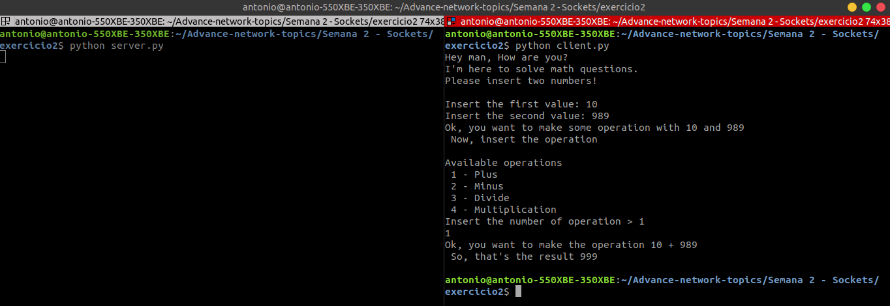
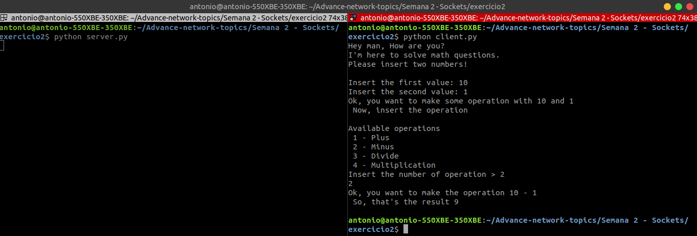
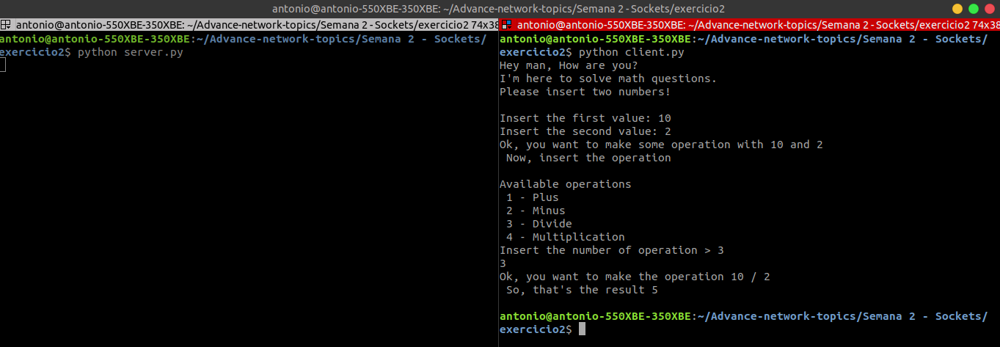
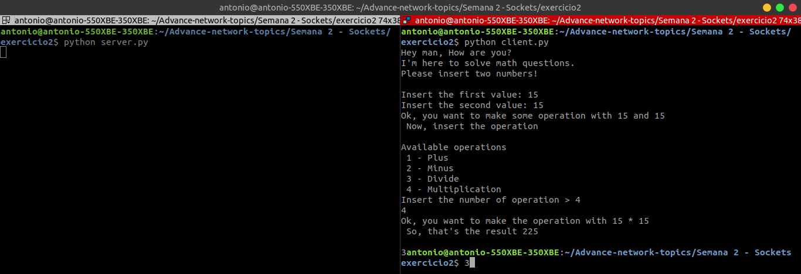

# Semana 2 - Sockets

## Table of Contents
* [Integrantes](#integrantes)
* [Exercício 1](#exercício-1)
* [Exercício 2](#exercício-2)

## Integrantes
| Name           | R.A.           |
| -----------    | -----------    |
| Antonio Muniz  | 22.119.001-0   |
| João Dias      | 22.119.006-9   |
| Weverson       | 22.119.004-4   |


## Exercício 1

### Run Server
```terminal
python server.py
```
### Run Client
```terminal
python client.py
```

### Available Commands (without case-sensitive)

* [COMMANDS](#commands)
* [TIME](#time)
* [Good Morning, Good Afternoon, Good Night](#Good-Morning,-Good-Afternoon,-Good-Night)
* [EXIT](#exit)

### First Access

In the first access the J.A.W ask you a name to call you the next time you connect


### Commands

List all commands available in server


### Time

Show the current time in server


### Good Morning, Good Afternoon, Good Night

Answer your greeting and correct it if it's not the correct time


### Exit

Finish connection with server


## Exercício 2

### Run Server
```terminal
python server.py
```
### Run Client
```terminal
python client.py
```

### Command

* [Make math operation plus](#commandOperationPlus)
* [Make math operation minus](#commandOperationMinus)
* [Make math operation divide](#commandOperationDivide)
* [Make math operation multiply](#commandOperationMultiply)

### First Access

In the first access the server will send to you a welcome message


### Make math operation plus

Ask to the two numbers and the number code of operation, in this case the first operation



### Make math operation minus

Ask to the two numbers and the number code of operation, in this case the second operation



### Make math operation divide

Ask to the two numbers and the number code of operation, in this case the third operation



### Make math operation multiply

Ask to the two numbers and the number code of operation, in this case the fourth operation


