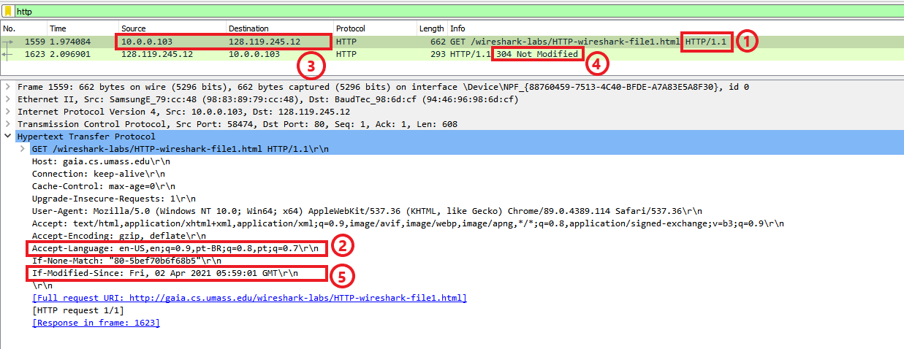
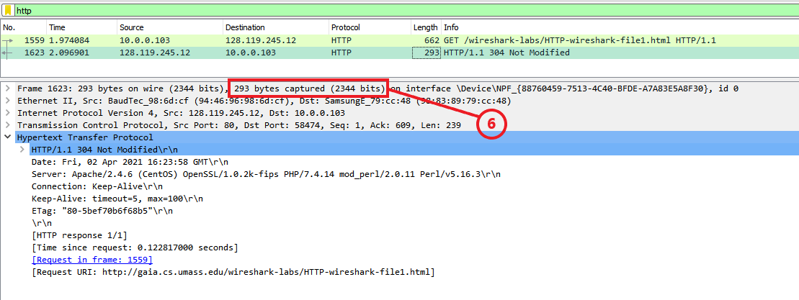
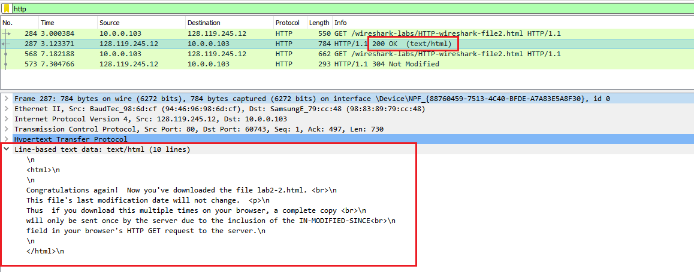
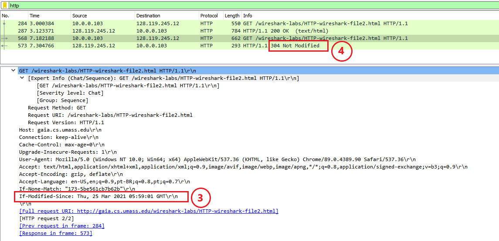
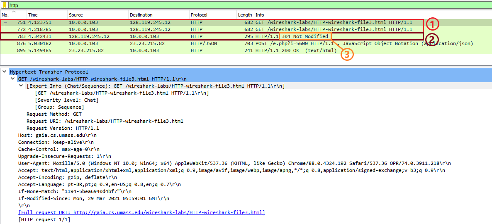
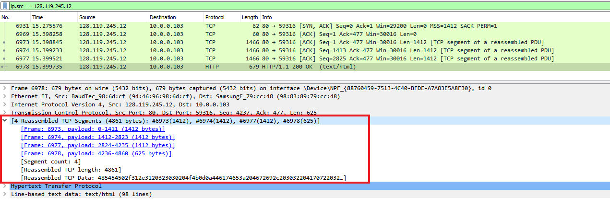

# Cache and Cookies - Wireshark

## Table of Contents
* [Exercício 1](#exercise-1)
* [Exercício 2](#exercise-2)
* [Exercício 3](#exercise-3)

## Exercise 1

1. HTTP Version

        HTTP/1.1

2. Languages 

        English (United States)
        Portuguese (Brazil)

3. Source and Destination's IP

        My machine: 10.0.0.103
        Server: 128.119.245.12

4. Server Code

        304 Not Modified

5. Last time modified

        Fri, 02 Apr 2021 05:59:01 GMT

6. Bytes sent to browser

        293 Bytes (2344 bits)

     

7. Header not in package

        None

## Exercise 2

1. Cache in the 1st Message

        No

2. Return of the server

        200 OK
        It returned an html page in the application layer because it wasthe first time accessing the site and it was not stored in browser's cache

     
     

3. Last modified

        Thu, 25 Mar 2021 05:59:01 GMT

4. Second Server Code

        304 Not Modified
        The server doesn't return the content because it's already in stored in browser's cache

## Exercise 3

1. GET Messages

        The browser sent 1 GET message (Line 1398)

2. Answer to the GETs
        
        The answer is in line 1446

3. Code returned in anser
        
        304 Not Modified

4. TCP Protocols

        It was necessary 4 reassembled TCP segments to send the HTML page

   
